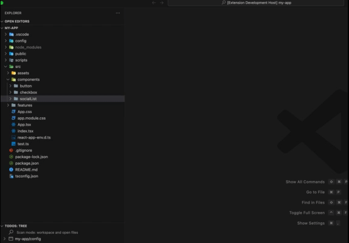

# React Component Generator

## Features

Adds a folder context menu item for creating a folder with all necessary files

## Extension Settings

Include if your extension adds any VS Code settings through the `contributes.configuration` extension point.

For example:

This extension contributes the following settings:

* `createReactComponent.index.snippet`: Specifies the content of the created index file.
* `createReactComponent.tsx.snippet`: Specifies the content of the created tsx file.
* `createReactComponent.styles.snippet`: Specifies the content of the created styles file.

You can use the following variables in your content snippets:

* `${name:pascal}`: Name of the component you provided in PascalCase (MyAwesomeComponent).
* `${name:kebab}`: Name of the component you provided in kebab-case (my-awesome-component).
